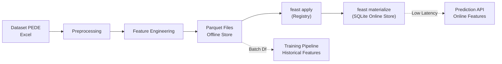

# 🎯 Datathon Passos Mágicos — Previsão de Risco de Defasagem Escolar

API de Machine Learning para estimar o risco de **defasagem escolar** dos estudantes da Associação Passos Mágicos, construída com **XGBoost** e **FastAPI**.

---

## 📋 Visão Geral

### Problema de Negócio
A Associação Passos Mágicos transforma a vida de crianças e jovens em vulnerabilidade social por meio da educação. Este projeto prevê quais alunos estão **em risco de defasagem escolar**, permitindo intervenções educacionais preventivas.

### Solução Proposta
Pipeline completa de Machine Learning usando **XGBoost** como classificador binário:
- **Em Risco** (Defasagem ≤ -2): aluno atrasado 2+ fases
- **Sem Risco** (Defasagem ≥ -1): aluno no nível adequado ou levemente atrasado

### Resultados do Modelo

#### Métricas (Conjunto de Teste)

| Métrica | Valor |
|---------|-------|
| **Accuracy** | 95.93% |
| **Precision** | 99.13% |
| **Recall** | 95.00% |
| **F1-Score** | 97.02% |
| **AUC-ROC** | 99.66% |

#### Cross-Validation Independente (5-Fold)

| Métrica | Média ± Std |
|---------|-------------|
| **Accuracy** | 96.40% ± 0.85% |
| **Precision** | 97.70% ± 1.58% |
| **Recall** | 97.17% ± 1.35% |
| **F1-Score** | 97.42% ± 0.60% |
| **AUC-ROC** | 99.26% ± 0.61% |

> O desvio padrão baixo (< 1.6%) em todas as métricas confirma que o modelo **generaliza bem** e não apresenta overfitting.

### Stack Tecnológica
- **Linguagem**: Python 3.11
- **ML**: scikit-learn, XGBoost, pandas, numpy, matplotlib
- **Feature Store**: Feast + SQLite (Online) + Parquet (Offline)
- **API**: FastAPI + Uvicorn
- **Serialização**: joblib
- **Testes**: pytest (126 testes)
- **Empacotamento**: Docker
- **Monitoramento**: drift detection (PSI, KS-test)

---

## 🏛️ Arquitetura do Feature Store

A aplicação agora utiliza o **Feast** como Feature Store local para centralizar e garantir a consistência das features entre treinamento e inferência.



---

## 📁 Estrutura do Projeto

```
datathon/
├── app/
│   ├── api/
│   │   ├── routes.py          # Endpoints FastAPI
│   │   └── schemas.py         # Modelos Pydantic
│   ├── core/
│   │   └── config.py          # Configurações centrais
│   ├── ml/
│   │   ├── preprocessing.py   # Pré-processamento
│   │   ├── feature_engineering.py  # Engenharia de features
│   │   ├── train.py           # Pipeline de treinamento
│   │   ├── evaluate.py        # Métricas e Avaliação
│   │   └── predict.py         # Predição
│   ├── monitoring/
│   │   └── drift.py           # Detecção de data drift
│   └── main.py                # Entrada da aplicação
├── feature_store/             # Feast Feature Store
│   ├── data/                  # SQLite DBs e .parquet
│   ├── data_sources.py        # Fontes de dados Parquet
│   ├── entities.py            # Entidade Aluno
│   ├── feature_store_manager.py # Interface do Feast
│   ├── feature_store.yaml     # Config do Feast
│   └── features.py            # 8 Feature Views
├── scripts/
│   └── materialize_features.py # Script de materialização
├── data/                       # Dataset PEDE 2024
├── models/                     # Modelos serializados
├── tests/                      # Testes unitários (126 testes)
├── train_pipeline.py           # Script CLI de treinamento
└── docker-compose.yml
```

---

## 🚀 Instruções de Deploy

### Pré-requisitos
- Python 3.11+
- pip

### 1. Configurar Ambiente Virtual (Recomendado)

```bash
# Criar venv
python -m venv venv

# Ativar venv (Windows)
.\venv\Scripts\activate

# Instalar dependências
pip install -r requirements.txt
```

### 2. Inicializar o Feature Store

Antes de treinar ou usar a API, popule o Feature Store:

```bash
python scripts/materialize_features.py
```
Isso irá criar os arquivos Parquet (offline store) e popular o SQLite (online store).

### 3. Treinar o Modelo

```bash
# Treinamento usando as features salvas no Feature Store
python train_pipeline.py --use-feature-store

# Treinamento completo (com otimização e Feature Store)
python train_pipeline.py --use-feature-store

# Sem a feature IAN (já é o padrão)
python train_pipeline.py --no-ian
```

### 4. Iniciar a API

```bash
python -m uvicorn app.main:app --host 127.0.0.1 --port 8000
```

A documentação interativa estará em: http://localhost:8000/docs


### 4. Analise dos dados
TIER 1 — Usar com confiança (< 30% nulos, alta relevância)
Feature	Tipo	Escala	Nulos	Normalização	Observação
INDE	Numérico	0–10	~20%	StandardScaler	Índice composto principal
IAA	Numérico	0–10	~20%	StandardScaler	Auto-avaliação do aluno
IEG	Numérico	0–10	~20%	StandardScaler	Engajamento (lições de casa)
IPS	Numérico	0–10	~20%	StandardScaler	Psicossocial
IDA	Numérico	0–10	~20%	StandardScaler	Desempenho acadêmico
IPP	Numérico	0–10	~20%	StandardScaler	Psicopedagógico
IPV	Numérico	0–10	~20%	StandardScaler	Avaliação de "ponto de virada"
PEDRA	Ordinal	4 classes	~20%	OrdinalEncoder (1-4)	Hierarquia natural
Idade	Numérico	~8–20	~25%	StandardScaler	Demográfica
Ano ingresso	Numérico	2016–2022	~25%	Derivar Anos_na_PM	Tempo no programa
Gênero	Binário	2 classes	~25%	LabelEncoder (0/1)	Demográfica
TIER 2 — Usar com cautela (30–60% nulos ou risco de leakage)
Feature	Tipo	Nulos	Problema	Recomendação
IAN	Numérico (discreto: 0, 5, 10)	~25%	DATA LEAKAGE — é praticamente sinônimo de defasagem. Domina com 58.4% de importância	REMOVER do modelo principal. IAN mede "adequação ao nível", que é o próprio target
DEFASAGEM	Numérico	~30%	É o target, não feature	Usar só para criar y
Ponto de Virada	Binário	~25%	Pode ser consequência, não causa	Usar com monitoramento
Rec Psicologia	Ordinal (5 níveis)	~40%	Muitos nulos	Imputar como "Não avaliado" (0)
Rec Avaliador 1/2	Ordinal (5 níveis)	~40%	Possível leakage — avaliadores podem ver defasagem	Testar modelo com e sem
TIER 3 — Evitar (> 60% nulos ou irrelevantes)
Feature	Nulos	Por que evitar
NOTA_PORT / NOTA_MAT / NOTA_ING	~70-80%	Quase inútil — tão poucos dados que a imputação por mediana distorce a realidade
Cg, Cf, Ct	~25%	Significado não documentado no dicionário. Rankings internos? Possível leakage
DESTAQUE_IEG/IDA/IPV	Texto livre	Não processável sem NLP
REC_EQUIPE_*	~50%	Muitas categorias, muitos nulos
TURMA	~30%	Identificador, sem valor preditivo
NOME	0%	Identificador pessoal
INDE_CONCEITO	~20%	Redundante — é apenas a faixa do INDE
Nº Av	~25%	Se reflete número de avaliações do mesmo período, pode ser leaker

### 5. Deploy com Docker

```bash
# Build
docker build -t datathon-passos .

# Run
docker run -p 8000:8000 datathon-passos

# Ou com docker-compose
docker-compose up -d
```

---

## 🔌 Exemplos de Chamadas à API

### Health Check

```bash
curl http://localhost:8000/health
```

**Resposta:**
```json
{
  "status": "ok",
  "model_loaded": true,
  "model_name": "xgboost_defasagem",
  "model_version": "1.0.0"
}
```

### Predição Individual

```bash
curl -X POST http://localhost:8000/predict \
  -H "Content-Type: application/json" \
  -d '{
    "IAA": 7.5,
    "IEG": 8.0,
    "IPS": 6.5,
    "IDA": 7.0,
    "IPV": 5.5,
    "IAN": 5.0,
    "INDE 22": 7.2,
    "Matem": 7.5,
    "Portug": 6.8,
    "Inglês": 7.0,
    "Idade 22": 14,
    "Gênero": "Menina",
    "Instituição de ensino": "Escola Pública",
    "Ano ingresso": 2018,
    "Pedra 22": "Ametista",
    "Rec Psicologia": "Sem limitações",
    "Atingiu PV": "Não",
    "Indicado": "Não",
    "Cg": 300,
    "Cf": 50,
    "Ct": 5,
    "Nº Av": 3
  }'
```

**Resposta:**
```json
{
  "prediction": 0,
  "probability": 0.1234,
  "risk_level": "Muito Baixo",
  "label": "Sem Risco",
  "top_factors": [
    {"feature": "Nº Av", "importance": 0.1113},
    {"feature": "Idade 22", "importance": 0.0754}
  ]
}
```

### Predição em Lote

```bash
curl -X POST http://localhost:8000/predict/batch \
  -H "Content-Type: application/json" \
  -d '{"students": [<aluno1>, <aluno2>, ...]}'
```

### Informações do Modelo

```bash
curl http://localhost:8000/model-info
```

### Learning Curves (PNG)

```bash
curl http://localhost:8000/learning-curve --output learning_curves.png
```

### Monitoramento de Drift

```bash
curl http://localhost:8000/monitoring/drift
curl http://localhost:8000/monitoring/stats
```

---

## 🔬 Pipeline de Machine Learning

### 1. Pré-processamento
- Carregamento do dataset PEDE 2024 (860 alunos × 42 colunas)
- Criação da variável target binária (Defas ≤ -2 → em risco)
- Codificação ordinal de categóricas (Pedras, Gênero, Escola, Rec. Psicologia)
- Tratamento de nulos (mediana para Math/Port, NaN nativo para XGBoost)

### 2. Engenharia de Features
- **35 features** selecionadas (sem IAN — removido por data leakage)
- Evolução temporal das Pedras (2020→2022, 2021→2022)
- Anos na Passos Mágicos
- Flags de destaque (IEG, IDA, IPV)
- Features derivadas: `Variancia_indicadores`, `Ratio_IDA_IEG`

### 3. Treinamento com Regularização

O XGBoost é treinado com **regularização** para evitar overfitting (sem regularização, o treino atingia 100%):

| Parâmetro | Valor | Efeito |
|-----------|-------|--------|
| `max_depth` | 4 | Limita profundidade das árvores (padrão: 6) |
| `min_child_weight` | 5 | Mínimo de amostras por folha |
| `subsample` | 0.8 | Amostragem de 80% dos dados por árvore |
| `colsample_bytree` | 0.8 | Amostragem de 80% das features por árvore |
| `reg_alpha` | 0.1 | Regularização L1 (sparsity) |
| `reg_lambda` | 1.0 | Regularização L2 (weight decay) |
| `learning_rate` | 0.1 | Taxa de aprendizado conservadora |
| `n_estimators` | 200 | Mais árvores compensam o learning_rate menor |

Essa configuração reduziu o score de treino de **1.000 para ~0.99** e manteve o score de validação estável, eliminando o overfitting.

### 4. Validação

- **Cross-Validation Independente (5-Fold)**: avalia generalização do modelo no dataset completo, reportando média ± desvio padrão por métrica
- **Learning Curves**: gráfico de treino vs validação em função do tamanho do dataset para diagnóstico visual de overfitting/underfitting
- Métrica primária: **F1-Score** (equilíbrio entre precisão e recall)
- Priorização do **Recall** (evitar falsos negativos — não perder alunos em risco)

### 5. Top Features

| # | Feature | Importância |
|---|---------|------------|
| 1 | Nº Avaliações | 11.13% |
| 2 | Idade 22 | 7.54% |
| 3 | Fase (encoded) | 7.51% |
| 4 | Indicado (flag) | 7.07% |
| 5 | Cf | 6.73% |

> A importância está bem distribuída entre as features (max. 11%), indicando que o modelo não depende de uma única variável.

---

## 🧪 Testes

```bash
# Executar todos os testes
pytest tests/ -v

# Com cobertura
pytest tests/ --cov=app --cov-report=term-missing

# Verificar cobertura mínima de 80%
pytest tests/ --cov=app --cov-fail-under=80
```

**Resultado atual**: 105 testes passando.

---

## 📊 Monitoramento

A API inclui monitoramento contínuo de **data drift**:

- **PSI (Population Stability Index)**: detecta mudanças na distribuição das features
- **KS-test**: teste estatístico contra distribuição de referência
- **Logs de predição**: todas as predições são registradas para análise

Endpoints:
- `GET /monitoring/drift` — Status de drift por feature
- `GET /monitoring/stats` — Estatísticas das predições

---

## 📄 Licença

Projeto desenvolvido para o Datathon PÓS TECH — Machine Learning Engineering.

